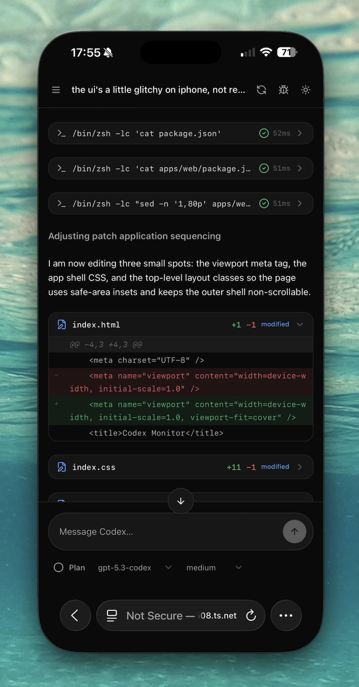

# Farfield

Remote control for AI coding agents — read conversations, send messages, switch models, and monitor agent activity from a clean web UI.

Supports [Codex](https://openai.com/codex) and [OpenCode](https://opencode.ai).

Built by [@anshuchimala](https://x.com/anshuchimala).

This is an independent project and is not affiliated with, endorsed by, or sponsored by OpenAI or the OpenCode team.

[](https://buymeacoffee.com/achimalap)



## Features

- Thread browser grouped by project
- Chat view with model/reasoning controls
- Plan mode toggle
- Live agent monitoring and interrupts
- Debug tab with full IPC history

## Install & Run

```bash
bun install
bun run dev
```

Opens at `http://localhost:4312`. Defaults to Codex.

**Agent options:**

```bash
bun run dev -- --agents=opencode             # OpenCode only
bun run dev -- --agents=codex,opencode       # both
bun run dev -- --agents=all                  # expands to codex,opencode
bun run dev:remote                           # network-accessible (codex)
bun run dev:remote -- --agents=opencode      # network-accessible (opencode)
```

> **Warning:** `dev:remote` exposes Farfield with no authentication. Only use on trusted networks.

## Remote Security (Required for Phone Use)

Before using Farfield from a phone over Tailscale or any non-local network, enable auth and restrict CORS.

### Environment Variables

- `FARFIELD_AUTH_TOKEN` (required for protected remote use)
- `FARFIELD_ALLOWED_ORIGINS` (comma-separated browser origins for web clients; no wildcard)
- `FARFIELD_ENABLE_DEBUG_API` (`false` recommended for remote use)
- `FARFIELD_REQUIRE_AUTH_FOR_HEALTH` (optional, defaults to `false`)

### Recommended Remote Run (Tailscale)

```bash
export FARFIELD_AUTH_TOKEN='replace-with-strong-token'
export FARFIELD_ALLOWED_ORIGINS='http://100.x.y.z:4312'
export FARFIELD_ENABLE_DEBUG_API='false'

bun run dev:remote
```

Notes:
- Use your Mac's Tailscale IP in place of `100.x.y.z`
- Native mobile apps are not browser-CORS constrained in the same way, but web clients still are
- `/events` accepts bearer auth and can also accept `?access_token=...` for SSE clients that cannot send auth headers

### Remote Verification (curl)

Protected API without token (expect `401`):

```bash
curl -i http://127.0.0.1:4311/api/threads
```

Protected API with token (expect success):

```bash
curl -i \
  -H "Authorization: Bearer $FARFIELD_AUTH_TOKEN" \
  http://127.0.0.1:4311/api/threads
```

SSE endpoint with token (expect `200` and event stream):

```bash
curl -i -N \
  -H "Authorization: Bearer $FARFIELD_AUTH_TOKEN" \
  http://127.0.0.1:4311/events
```

Debug API blocked when disabled (expect `403`):

```bash
curl -i \
  -H "Authorization: Bearer $FARFIELD_AUTH_TOKEN" \
  http://127.0.0.1:4311/api/debug/history
```

CORS allowlist check (expect `Access-Control-Allow-Origin` only for allowed origin):

```bash
curl -i \
  -H "Origin: http://100.x.y.z:4312" \
  -H "Authorization: Bearer $FARFIELD_AUTH_TOKEN" \
  http://127.0.0.1:4311/api/threads
```

Approval API checks:

```bash
# create a thread and copy threadId from response
curl -s \
  -H "Authorization: Bearer $FARFIELD_AUTH_TOKEN" \
  -H "Content-Type: application/json" \
  -d '{}' \
  http://127.0.0.1:4311/api/threads

# read normalized pending approvals for a thread
curl -i \
  -H "Authorization: Bearer $FARFIELD_AUTH_TOKEN" \
  http://127.0.0.1:4311/api/threads/<thread-id>/pending-approvals

# submit approve/deny decision for a pending approval request id
curl -i \
  -H "Authorization: Bearer $FARFIELD_AUTH_TOKEN" \
  -H "Content-Type: application/json" \
  -d '{"requestId":123,"decision":"approve"}' \
  http://127.0.0.1:4311/api/threads/<thread-id>/pending-approvals/respond
```

## Mobile App (Expo)

The `apps/mobile` workspace package (`@farfield/mobile`) is an Expo SDK 53 + TypeScript app that lets you monitor and control Codex from your phone over Tailscale.

### Mobile Prerequisites

- Bun 1.2+ (workspace manager)
- Expo Go or a physical device / simulator for testing

### Mobile Workspace Commands

Run from `farfield/`:

```bash
# Install all workspace dependencies (including mobile)
bun install

# Type-check the mobile package
bun run --filter @farfield/mobile typecheck

# Lint the mobile package
bun run --filter @farfield/mobile lint

# Start the Metro bundler (for Expo Go or simulator)
bun run --filter @farfield/mobile start
```

Or run from `farfield/apps/mobile/` directly:

```bash
bun run start          # Start Metro / Expo Dev Server
bun run ios            # Build and run on iOS Simulator
bun run android        # Build and run on Android Emulator
bun run typecheck      # TypeScript check
bun run lint           # Lint
```

### Mobile Setup (Connection Screen)

1. Start Farfield on your Mac in remote mode (see **Remote Security** section below).
2. Open the app on your phone.
3. Go to the **Settings** tab.
4. Enter your Mac's **Tailscale IP and port** as the Server URL (e.g. `http://100.x.x.x:4311`).
5. Paste your `FARFIELD_AUTH_TOKEN` in the Auth Token field.
6. Tap **Save Settings**.
7. Go to the **Connection** tab and tap **Test Connection** to verify reachability.

> The auth token is stored in device-encrypted secure storage (`expo-secure-store`).
> The server URL is stored in `AsyncStorage`.

## Requirements

- Node.js 20+
- Bun 1.2+
- Codex or OpenCode installed locally

## Codex Schema Sync

Farfield now vendors official Codex app-server schemas and generates protocol Zod validators from them.

```bash
bun run generate:codex-schema
```

This command updates:

- `packages/codex-protocol/vendor/codex-app-server-schema/` (stable + experimental TypeScript and JSON Schema)
- `packages/codex-protocol/src/generated/app-server/` (generated Zod schema modules used by the app)

## License

MIT
